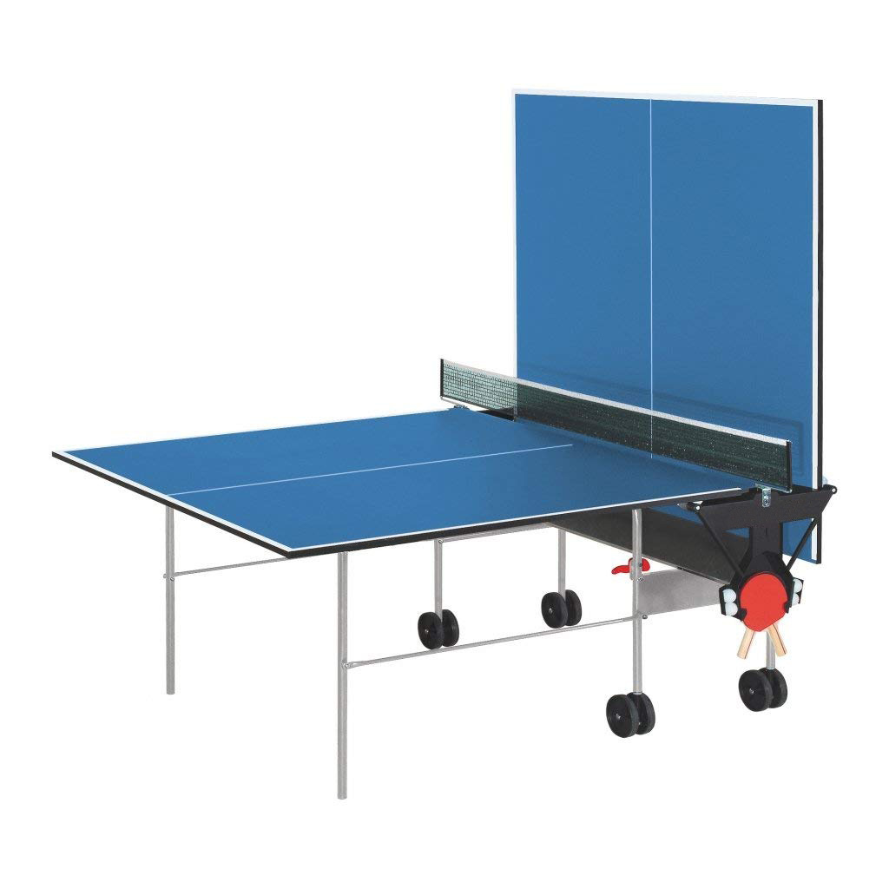

Proyecto de WebGL - Ping Pong

Animación de un juego de ping pong. El ciclo que la pelota va a seguir será estático. Va a haber dos raquetas de ping pong flotando para darle continuidad al ciclo de la pelota. La cámara se va a poder mover en un circulo alrededor de la mesa con las flechas del teclado. Se puede ver el proyecto aqui: https://a01283132.itch.io/webgl-pingpong

Se utilizará Unity para el proyecto y esto será exportado a WebGL.

Se utilizan assets de este paquete: https://assetstore.unity.com/packages/3d/props/free-barcade-asset-pack-123704